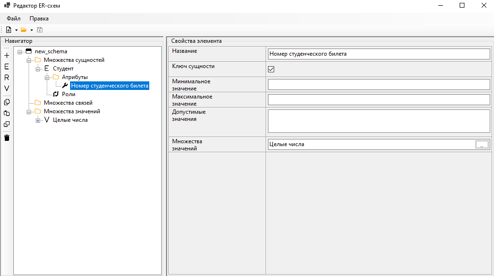

# ERSchemeEditor-NET
Реализация редактора ER-схем в нотации Чена на .NET с использованием Entity Framework и SQLite.

В редакторе поддерживается создание всех элементов классической ER-модели (множества сущностей, связей, значений; атрибуты, роли) в текстовом виде.

Для хранения схем используется файл локальной БД SQLite.

>This application uses NuGet packages FontAwesome.Sharp (https://github.com/awesome-inc/FontAwesome.Sharp) and Microsoft.EntityFrameworkCore.Sqlite version 9.0.2.
>
>FontAwesome.Sharp is available under the Apache 2.0 license. A copy of the license is available [here](assets/LICENCE.FASharp.txt).
>Microsoft.EntityFrameworkCore.Sqlite version 9.0.2 is available under the MIT license. A copy of the license is available [here](assets/LICENCE.MSEFCore.txt).
>
>No changes were done to the source code of the libraries.
